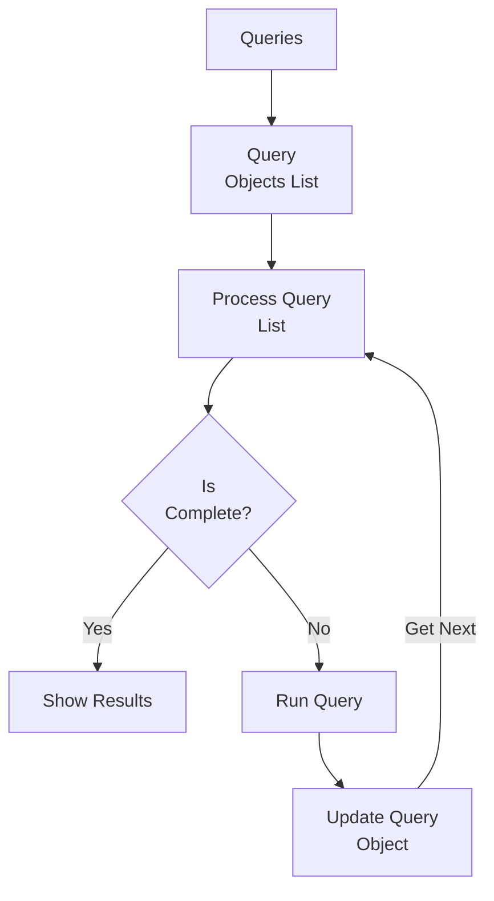

# Description
This is a Rust cli that uses odbc to run a query from a file, log the query and the results, and, if directed, output the results to the terminal, to a file, or both.

## Database Support
Pending
    
- Informix

Contribute?
    
- Postgres

## Multiple Queries Flow

[Edit Flow Chart](https://mermaid.live/edit#pako:eNplUUtPwkAQ_iubORdTEAzZg0aoEBNFBT1oy2FtB1ptu2QfAWz7393ugkGd0-z3mPmyU0HMEwQKq5xv45QJRZ6DqCSmrsMnjSJDuex0LgkZhS3YQnvH_6uH9w-MlSR3mVRLpxmR1jsJHwWPUUpnJ0f_iXBihePKtLfyyI95sclR4VXjkLEV1a8o65twkfItmaPUuZLLX_yM10E416XbduACy03Dl03CFP4Jcpr_oJ-6WVNUZIY7VU_AgwJFwbLE_FbViiJQKRYYATVtwsRnBFHZGB3Tii_2ZQxUCY0eCK7XKdAVy6V5aZsgyNhasOIH3bASaAU7oL1-98y_8IeD7sDv986HQw_2QP3Ggy_OjaHrASaZ4uLeXc4e0A54s3y7s_kGAYqLDg)

